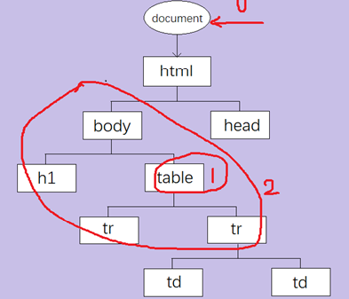

# DOM 和 js

- DOM(文档对象模型)是用于HTML和XML文档的API(应用程序编程接口),DOM就是接口对象，比如JDOM(java dom),XML DOM  
js是一种脚本语言,是不需要进行编译。
  > DOM API:定义文档的结构,访问方式,操作方式.
- DOM举例，HTML DOM
  1. 定义文档结构--节点对象树，
  
## js引用和书写

- 加载外部js,页面会暂停处理，其中对于html来说：先加载<head>所以如果js太多会空白，放body后。加上type表示使用的是javascript可以换java等
- 可以加上async来进行立即下载，延迟执行，可以放<head>中了，(异步)如上确保两者之间互不依赖，
- "use strict";在标签内加上这个会严格模式，报错一些问题，在js中，如果某个变量没有var声明，会自动移到上一层作用域中找声明语句，有就是这个。没有就套娃到全局。

## 用法
- typeof message用于查看是那种类型。var me=Boolean(message)这样转换可以判断字符串是否为空，因为字符串强制转换，""和（空串）都会是false,可以测数值0，对象null。可以直接if (me)。如果message='2'是对象的话很可能就改变了程序流程
